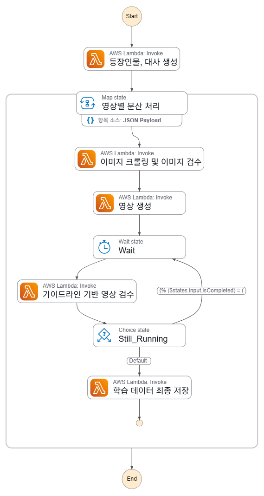
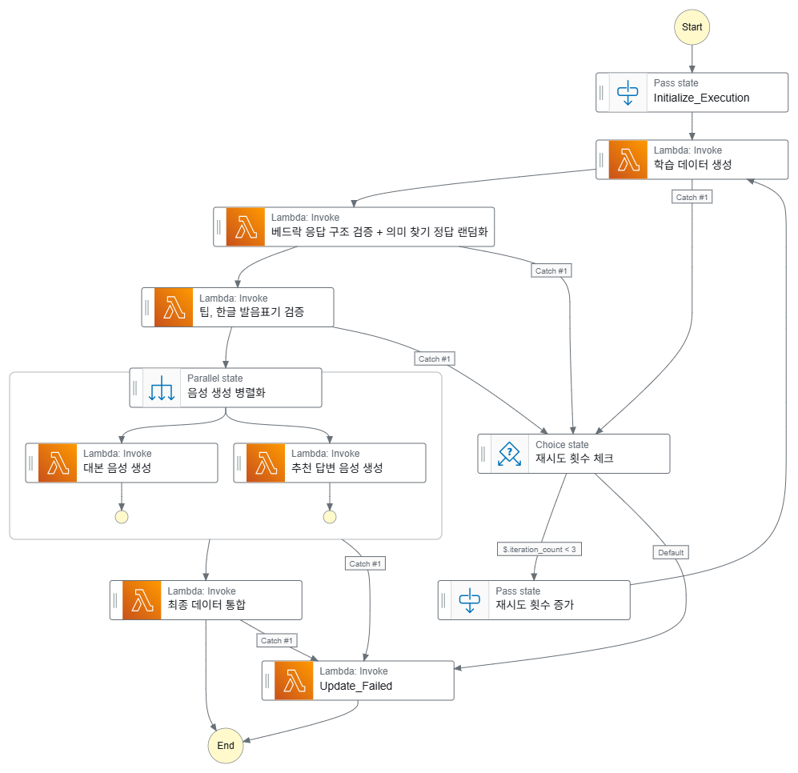
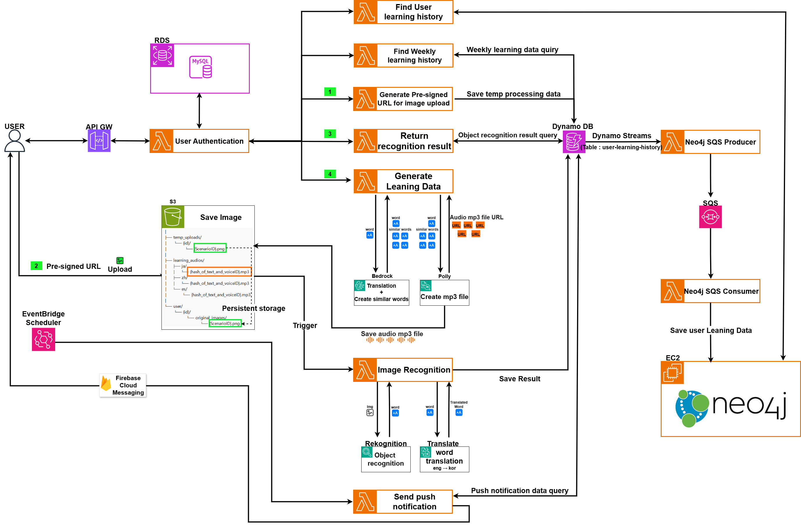
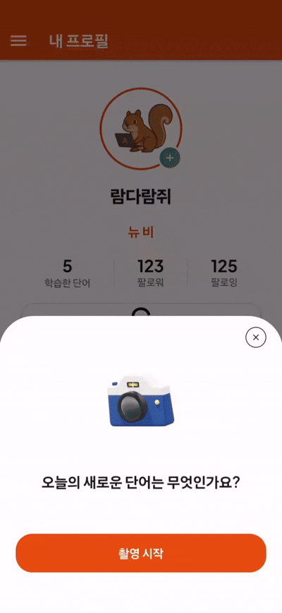

# Whik!

<p align="center">
  
</p>

<p align="center"><strong>휙! 넘기다 보면 말이 트인다!</strong></p>

<br>

## 간단 소개
**Whik(휙!)** 은 숏폼 기반 외국어 학습 모바일 앱입니다.  
짧고 몰입감 있는 영상 콘텐츠를 활용하여 기존 언어 학습 앱의 높은 **이탈률 문제를 개선**하고, **듣기·말하기·문법 능력**을 동시에 향상시키는 새로운 학습 경험을 제공합니다.

<br>

## 주요 기능

### 사용자 기능
- **숏폼 콘텐츠 제공** — 사용자의 흥미를 끄는 영상 기반 학습
- **테마별 학습** — 카페, 편의점 등 실생활 테마 중심 콘텐츠
- **청해력 향상** — 영상 시청 후 의미 추론 방식으로 듣기 능력 향상
- **문법 학습** — 문장 청크 배치 기반 구조적 이해
- **말하기 학습** — 영상 속 인물 대사 따라하기
- **응답 학습** — 영상 속 질문에 직접 대답하여 스피킹 훈련

### 영상 자동 생성 파이프라인
1. html 폼을 통해 입력
2. Bedrock로 스크립트 생성 
3. 레퍼런스 이미지 크롤링
4. Veo3 영상 생성
5. 가이드라인 기반 검증
6. 영상 및 스크립트 S3 · DynamoDB 자동 저장

### 학습 데이터 자동 생성 파이프라인
1. DynamoDB Streams 이벤트 감지
2. Lambda Trigger 및 Step Functions 연동
3. Bedrock 학습 데이터 생성
4. json 구조 검증, Bedrock을 통한 교육적 품질 검증
5. 학습 관련 음성 병렬 생성
6. 최종 학습 데이터 S3 · DynamoDB 자동 저장

<br>

## 시연

|  |  |  |
|:---:|:---:|:---:|
|  |  |  |

<br>

## 시스템 아키텍처

<p align="center">
  
</p>

### Step Functions 워크플로우

| 영상 자동 생성 | 학습 데이터 자동 생성 |
|:---:|:---:|
|  |  |

<br>

## 기술 스택

| 카테고리 | 기술 |
| :--- | :--- |
| **Frontend & App** |   |
| **Backend & Cloud** |     |
| **Data & Storage** |     |
| **Messaging & Orchestration** |   |
| **AI/ML & Processing** |     |
| **Deployment & CDN** |   |


<br>

## 폴더 구조

```bash
📂 Whik
 ├── API_Gateway/        # API Gateway 설정 및 통합
 ├── CloudFront/         # CloudFront 배포 구성
 ├── DynamoDB/           # DynamoDB 테이블 스키마
 ├── EC2/                # 웹 서버 구성
 ├── EventBridge/        # 이벤트 스케줄러
 ├── Lambda/             # Lambda 함수 코드
 ├── RDS/                # MySQL 스키마
 ├── S3/                 # 버킷/권한/CORS
 ├── SQS/                # 큐 설정
 └── Step_Functions/     # 워크플로우 정의
 ```

<br>

<details>
<summary><strong>제거된 기능 & 관련 자료 보기</strong></summary>

<br>

## 제거된 기능
> 초기 설계 대비, 집중 기능 강화를 위해 아래 기능을 제외했습니다.

1. 사진 기반 단어 학습
2. 주간 단어 학습 기록
3. 단어 학습 그래프

<br>

## 단어학습 아키텍처 구성도
<p align="center">
  
</p>

<br>

## 단어학습 그래프
<p align="center">
  
</p>

<br>

## 사진 기반 단어 학습 데모
<p align="center">
  
</p>

<br>

</details>

